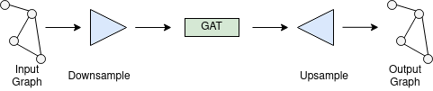

# Pytorch Fast GAT Implementation



This is my implementation of an old paper, [Graph Attention Networks](https://arxiv.org/pdf/1710.10903.pdf).
However, instead of a standard impementation, this one introduces several techniques to speed up the process,
which are found below.

## Installation

```
pip install fast_gat
```

Alternatively,

```
git clone https://github.com/tatp22/pytorch-fast-GAT.git
cd fast_gat
```

## What makes this repo faster?

What is great about this paper is that, besides its state of the art performance on a number of benchmarks,
is that it could be applied to any graph, regardless of its structure. However, this algorithm has a runtime
that depends on the number of edges, and when the graph is dense, this means that it can run in `nodes^2` time.

Most sparsifying techniques for graphs rely on somehow decreasing the number of edges. However, I will try out
a different method: Reducing the number of nodes in the interior representation. This will be done similarly to how
the [Linformer](https://arxiv.org/pdf/2006.04768.pdf) decreases the memory requirement of the internal matrices, which
is by adding a parameterized matrix to the input that transforms it. A challenge here is that since this is a graph,
not all nodes will connect to all other nodes. My plan is to explore techniques to reduce the size of the graph (the
nodes, that is), pass it into the GAT, and then upscale it back to the original size.

Seeing that sparse attention has shown to perfom just as well as traditional attention, could it be the same for graphs?
I will try some experiments and see if this is indeed the case.

This is not yet implemented.

Note: This idea has not been tested. I do not know what its performance will be on real life applications,
and it may or may not provide accurate results.

## Code Example

Right now, there exist two different versions of GAT: one for sparse graphs, and one for dense graphs. The idea in
the end is to use only the dense version, since the sparse version runs slower. It is currently not possible to use
the dense version on very large graphs, since it creates a matrix of size `(n,n)`, which will quickly drain the
system's memory.

As an example, this is how to use the sparse version:

```python
import torch
from fast_gat import GraphAttentionNetwork

nodes = torch.tensor([[0.1, 0.2, 0.3], [0.4, 0.5, 0.6], [0.7, 0.8, 0.9], [1.0, 1.1, 1.2]], dtype= torch.float)
edges = {0: {1,2}, 1: {0,2,3}, 2: {0,1}, 3: {1}}

depth = 3
heads = 3
input_dim = 3
inner_dim = 2

net = GraphAttentionNetwork(depth, heads, input_dim, inner_dim)

output = net(nodes, edges)
print(output)
```

A point of interest here that one may notice is that the modules assume the graph is directed and that the edges
have already been processed such that the nodes are zero indexed.

## Downsampling method

The main thing that I am experimenting with here is to somehow reduce the number of input vertices in the
input graph while keeping the edges connected in a way that makes sense.

Right now, I am looking into a learned iterative process; that is, some function `f: V x V -> V`
that takes two nodes and makes it into one, run on the graph over several iterations. I have a
method which looks promising and I will work on implementing the downsampling method; the upsampling is already done.

## Further work that needs to be done

* Create some sort of downsampling/upsampling method

## Citation

```
@misc{veličković2018graph,
      title={Graph Attention Networks}, 
      author={Petar Veličković and Guillem Cucurull and Arantxa Casanova and Adriana Romero and Pietro Liò and Yoshua Bengio},
      year={2018},
      eprint={1710.10903},
      archivePrefix={arXiv},
      primaryClass={stat.ML}
}
```
